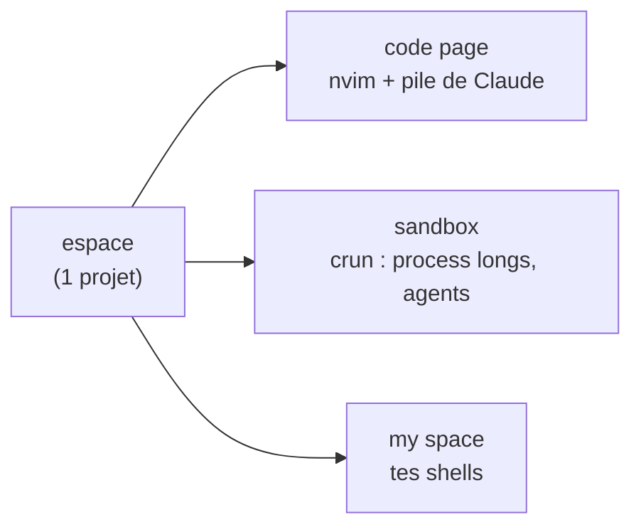
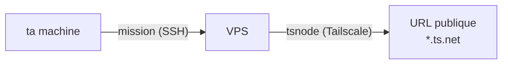

<div align="center">

# thedev

**Tes machines deviennent un seul atelier de dev piloté par l'IA.**
Terminal-natif, multi-machines, sur ton abonnement — **zéro port ouvert, zéro clé API.**


<p>
  
  &nbsp;&nbsp;&nbsp;
  
  &nbsp;&nbsp;&nbsp;
  
  &nbsp;&nbsp;&nbsp;
  
  &nbsp;&nbsp;&nbsp;
  
  &nbsp;&nbsp;&nbsp;
  
</p>

</div>

> **VSCode** _édite_ du code. **Claude Code** le _code pour toi_ — sur une machine.
> **OpenClaw / Hermes** te donnent un _assistant dans ta messagerie_ — au prix d'une clé API et d'un service exposé sur le net.
> **thedev fait coder l'IA à travers _toutes_ tes machines, depuis le terminal — sans rien exposer, sans API à payer.**

## Le combo que personne d'autre n'a

| | **thedev** | VSCode +Copilot | Claude Code | OpenClaw / Hermes |
|---|:--:|:--:|:--:|:--:|
| Interface | terminal (zellij) | GUI Electron | terminal | chat / messagerie |
| L'IA code | Claude Code natif | extension | natif | via API |
| **Déléguer entre machines** | ✅ missions SSH | ❌ | ❌ 1 machine | ❌ 1 hôte |
| **Process longs isolés** | ✅ `crun` / sandbox | onglets | ❌ | ❌ |
| **Exposer un service en public** | ✅ 0 port (Tailscale) | ❌ | ❌ | gateway exposé ⚠️ |
| Coût | abonnement | abo + API | abonnement | clés API 20–500 $/mo |
| Empreinte | bash + zellij, lisible en une soirée | lourde | légère | gateway Node + CVE |

Pas un nouvel éditeur, pas un nouveau modèle : **la couche qui transforme Claude Code en tissu de dev multi-machines.**

## Comment c'est foutu



Une **machine** porte des **espaces** (1 projet chacun) ; chaque espace a 3 **pages**, chaque page des **panes**. Un **crun** = un process long dans la sandbox. Vocabulaire complet : [`NAMING.md`](NAMING.md).

## Entre machines

Les espaces s'échangent des **missions** (Claude interactif, sur l'abonnement — jamais `claude -p`/crédits), et un service local s'expose en HTTPS public via un VPS **sans ouvrir un seul port**.



## Installer

**Avec l'IA** — installe le [CLI Claude](https://docs.claude.com/claude-code), clone, lance `claude`, et donne-lui :

> Installe thedev. Lis `README.md` et `MANIFEST.md`, vérifie les dépendances
> (`./bin/thedev-manifest --check-deps`), installe celles qui manquent, lance
> `./install.sh`, puis dis-moi comment démarrer `dev`.

**À la main :**

```bash
git clone https://github.com/jeanloupdb/thedev.git ~/thedev && cd ~/thedev
./bin/thedev-manifest --check-deps    # ce qui manque
./install.sh                          # puis : source ~/.bashrc && dev
```

Serveur : `./install.sh --vps=<label>`.

## Le reste

- **Toutes les commandes** : [`MANIFEST.md`](MANIFEST.md) (généré) ou `./bin/thedev-manifest`.
- **Dépendances** : zellij, claude, nvim, python3, git, jq, fzf, inotify-tools.
- **À toi** : `thedev-machines` (board cross-machine) — pars de `.example`, le vrai est gitignoré.
</content>
