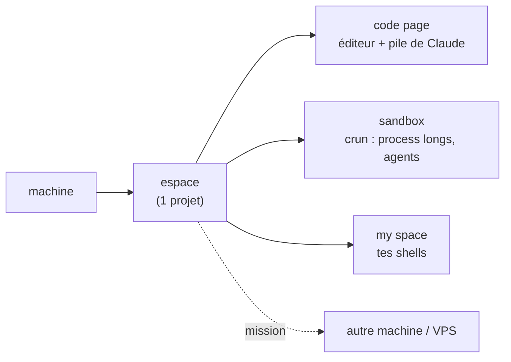

<div align="center">

# thedev

**L'atelier de dev en terminal qui pilote toutes tes machines avec Claude — sur ton abonnement, sans rien exposer.**


<!-- DÉMO : ajoute ici un GIF (vhs / asciinema → agg) du picker + du dashboard.
     C'est l'élément le plus important above the fold — il manque encore. -->

</div>

> [!IMPORTANT]
> La puissance d'un agent cloud, **chez toi** : **0 crédit API · 0 port ouvert · 0 clé**. Ton infra, tes machines, tes règles — et c'est lisible/auditable (bash + fichiers).

## ⚡ Installer (avec l'IA, en 1 minute)

Installe le [CLI Claude](https://docs.claude.com/claude-code), clone le repo, lance `claude` dedans, et colle :

> Installe thedev. Lis `README.md` et `MANIFEST.md`, vérifie les dépendances
> (`./bin/thedev-manifest --check-deps`), installe celles qui manquent, lance
> `./install.sh`, puis dis-moi comment démarrer `dev`.

<details>
<summary>… ou à la main</summary>

```bash
git clone https://github.com/jeanloupdb/thedev.git ~/thedev && cd ~/thedev
./bin/thedev-manifest --check-deps    # ce qui manque
./install.sh                          # puis : source ~/.bashrc && dev
```
Serveur : `./install.sh --vps=<label>`. Dépendances : zellij, claude, nvim, python3, git, jq, fzf, inotify-tools.
</details>

## Fonctionnalités

| Fonctionnalité | Ce que ça fait |
|---|---|
| 👁️ **Vue du parc** | Tous tes Claude et leur état (actif ● / arrêté ○) en un coup d'œil, organisés. |
| 🧩 **Claude en renfort** | Une idée hors sujet en plein travail ? Ouvre autant de Claude que tu veux dans ton espace. |
| 🔌 **Reprise 1 clic** | Reprends n'importe quelle session, locale ou distante, en un clic. |
| 🏷️ **Auto-nommage** | Les panes Claude se nomment seuls, en direct, au fil du sujet. |
| 📁 **1 dossier = 1 session** | Modèle simple et lisible, pas de boîte noire. |
| 🖥️ **Multi-machines** | Claude sur ton poste et tes serveurs, réunis en un seul espace de travail. |
| 📨 **Missions** | Claude sur ton poste envoie une tâche à un Claude sur ton VPS (avec choix du modèle) et reçoit le retour. |
| 🚚 **Partage entre machines** | Claude partage des dossiers entiers entre tes machines — sécurisé, respecte ton `.gitignore`. |
| 📲 **Pilotage à distance** | Un thedev sur ton VPS lance Claude en Remote Control : pilote ton serveur depuis l'app Claude. |
| ▶️ **Commandes longues** | Claude ouvre un terminal thedev dédié pour les commandes dont tu veux le retour — `npm start`, builds, watchers. |
| 🖧 **Tes terminaux** | Vois les logs en direct, tape une commande sans passer par l'IA. |
| 🙈 **Page « my space »** | Un terminal rien qu'à toi, hors de portée de Claude. |
| 🔒 **Secrets hors chat** | Onglet dédié pour saisir mot de passe / clé / sudo — l'IA ne les voit jamais. |
| 🧹 **Fermeture propre** | Avant de fermer un espace, vois ce que ça va couper (Ctrl+Q) : laisse en arrière-plan ou stoppe. |
| 📊 **Ressources en direct** | RAM, disque, CPU affichés en permanence — pour bosser sans saturer. |
| ⏳ **Fenêtre Claude 5h** | Combien il te reste avant le rate-limit Max, en direct — gratuit, pas de surprises. |
| 🌑 **Léger** | TUI minimaliste, thème noir — optimisé batterie et RAM. |
| ⏰ **Automatisations distantes** | Confie à un serveur une tâche rejouée dans le temps, par un Claude dédié. |
| 🛰️ **Headless** | Tourne en arrière-plan, pleine puissance sans interface — parfait pour laisser un Claude sur un serveur. |
| 🌐 **Exposition 0 port** | Via Tailscale, ton VPS publie un site en HTTPS à la demande. |
| 💳 **Sur ton abo** | Fonctionne sur ton abonnement Claude (sans API) → coût réduit. |

<sub>Ex. d'automatisation : « sur mon VPS, chaque matin, génère un article + son podcast audio et envoie-moi le lien sur Telegram. »</sub>

## Comment c'est organisé



Une **machine** porte des **espaces** (1 projet chacun), chaque espace a des **pages** et des **panes**. Un **crun** = un process long dans la sandbox. Les espaces s'échangent des **missions**. Vocabulaire complet : [`NAMING.md`](NAMING.md).

## Aller plus loin

- **Toutes les commandes** : [`MANIFEST.md`](MANIFEST.md) (généré) ou `./bin/thedev-manifest`
- **État du parc en direct** : `thedev-status` · **usage Claude** : la barre en bas

---

<div align="center">

Fait pour coder avec Claude sans louer le cloud. ⭐ si ça te parle.

</div>
