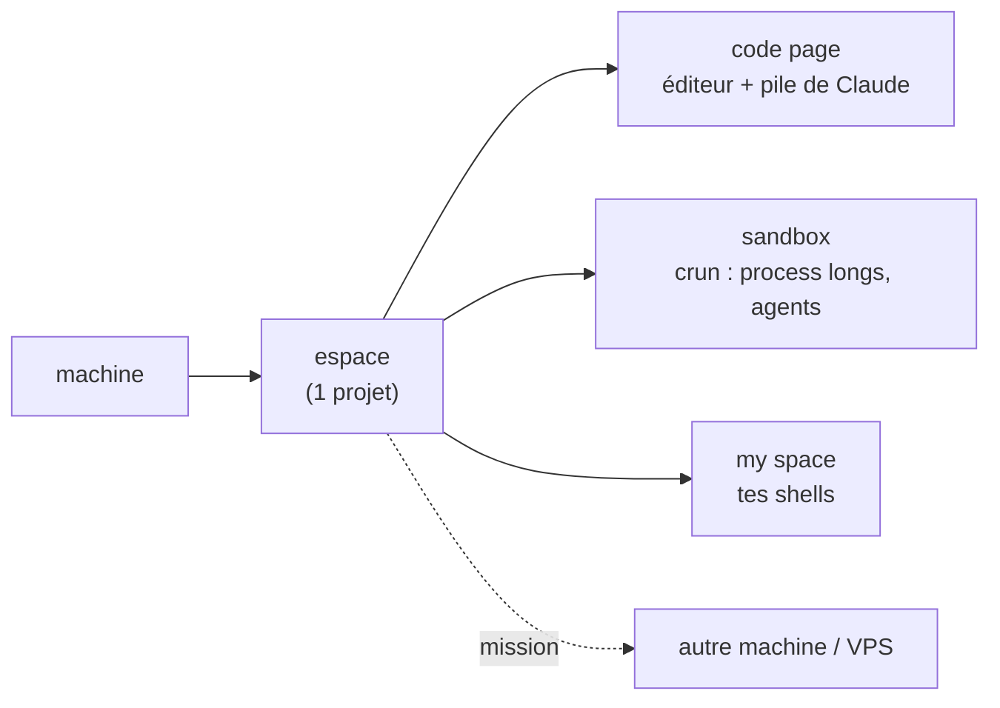

<div align="center">

# thedev

**L'atelier de dev en terminal qui pilote toutes tes machines avec Claude — sur ton abonnement, sans rien exposer.**


<!-- DÉMO : ajoute ici un GIF (vhs / asciinema → agg) du picker + du dashboard.
     C'est l'élément le plus important above the fold — il manque encore. -->

</div>

> [!IMPORTANT]
> La puissance d'un agent cloud, **chez toi** : **0 crédit API · 0 port ouvert · 0 clé**. Ton infra, tes machines, tes règles — et c'est lisible/auditable (bash + fichiers).

## ⚡ Installer (avec l'IA, en 1 minute)

Installe le [CLI Claude](https://docs.claude.com/claude-code), clone le repo, lance `claude` dedans, et colle :

> Installe thedev. Lis `README.md` et `MANIFEST.md`, vérifie les dépendances
> (`./bin/thedev-manifest --check-deps`), installe celles qui manquent, lance
> `./install.sh`, puis dis-moi comment démarrer `dev`.

<details>
<summary>… ou à la main</summary>

```bash
git clone https://github.com/jeanloupdb/thedev.git ~/thedev && cd ~/thedev
./bin/thedev-manifest --check-deps    # ce qui manque
./install.sh                          # puis : source ~/.bashrc && dev
```
Serveur : `./install.sh --vps=<label>`. Dépendances : zellij, claude, nvim, python3, git, jq, fzf, inotify-tools.
</details>

## Ce que tu peux faire

<table>
<tr>
<td width="50%" valign="top">

### 🛰️ Déléguer à tes machines
**Envoie une mission à un VPS** — il bosse pour toi, en autonomie, sur ton abonnement (pas d'API facturée).
<br><br>
<sub>Choisis le modèle (Fable / Opus / Sonnet) · board de tout ton parc · pilote une session VPS depuis l'app Claude · `ship` un dossier en une commande.</sub>

</td>
<td width="50%" valign="top">

### ⏰ Routines & veilles
**Une routine ou une veille que l'IA fait tourner sur ton VPS** — et que tu gères depuis thedev, en local.
<br><br>
<sub>Vois d'un coup d'œil si elle tourne, relance-la en 1 clic depuis l'accueil · livraisons & alertes sur Telegram.</sub>

</td>
</tr>
<tr>
<td width="50%" valign="top">

### 🌐 Expose un site, 0 port
**Mets un site/service local en HTTPS public** via ton VPS, sans ouvrir un seul port (Tailscale).
<br><br>
<sub>Une URL publique en composant `ship` → `mission` → `tsnode`. Rien à toucher côté réseau.</sub>

</td>
<td width="50%" valign="top">

### 🤖 Une équipe de Claude
**Plusieurs Claude en parallèle** dans un même espace, en autonomie (permissions bypass).
<br><br>
<sub>Panes auto-nommés par sujet · retrouve tes Claude là où tu les avais laissés après un quit.</sub>

</td>
</tr>
<tr>
<td width="50%" valign="top">

### 🎛️ Tout sous les yeux
**Ton usage Claude (fenêtre 5h) + RAM + CPU** affichés en permanence, discrètement.
<br><br>
<sub>Page Infos / dashboard (version, parc, santé système) · tout sur l'abonnement : 0 crédit, 0 port, 0 clé.</sub>

</td>
<td width="50%" valign="top">

### 📦 Process longs isolés
**Lance et gère tout process long** (serveur, build, watcher, agent) dans une sandbox.
<br><br>
<sub>Déduplication, vivacité, logs — sans jamais polluer ta session de dev.</sub>

</td>
</tr>
<tr>
<td colspan="2" valign="top">

### 🔒 Tes secrets ne passent jamais par le chat
**Une clé API, un mot de passe, un token à fournir ?** L'IA t'ouvre un **pane sandbox dédié** où tu **colles directement** — prompt masqué, le secret part vers la machine cible par stdin (`chmod 600`, hors git), **jamais** dans la conversation ni l'historique.
<br><br>
<sub>L'IA confirme par la taille/les permissions du fichier, jamais par son contenu — elle ne voit pas la valeur. Le réflexe par défaut pour tout ce qui est confidentiel.</sub>

</td>
</tr>
</table>

## Comment c'est organisé



Une **machine** porte des **espaces** (1 projet chacun), chaque espace a des **pages** et des **panes**. Un **crun** = un process long dans la sandbox. Les espaces s'échangent des **missions**. Vocabulaire complet : [`NAMING.md`](NAMING.md).

## Aller plus loin

- **Toutes les commandes** : [`MANIFEST.md`](MANIFEST.md) (généré) ou `./bin/thedev-manifest`
- **État du parc en direct** : `thedev-status` · **usage Claude** : la barre en bas

---

<div align="center">

Fait pour coder avec Claude sans louer le cloud. ⭐ si ça te parle.

</div>
