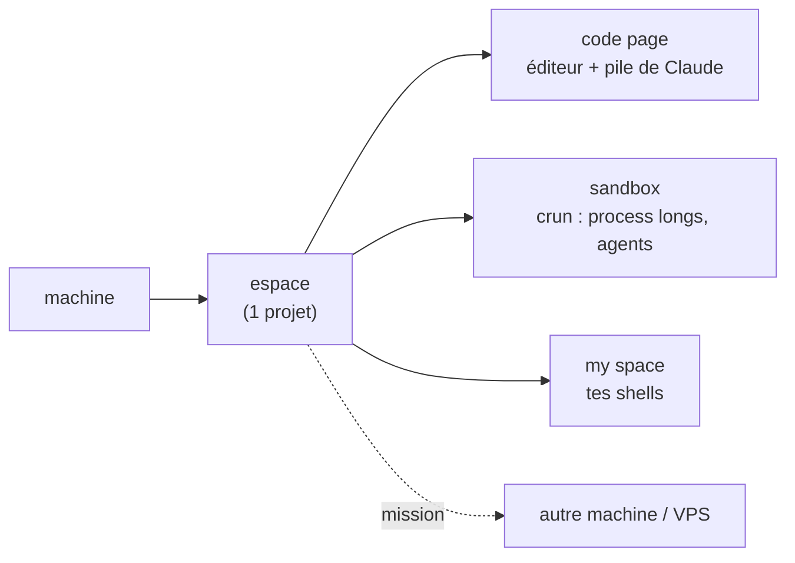

<div align="center">

# ⚔️ thedev

### Pars à la conquête du monde avec une armée d'agents.


<!-- DÉMO — génère le GIF puis décommente la ligne dessous :  vhs demo.tape  →  demo.gif -->
<!--  -->

</div>

> **Sais-tu diriger des hommes ?** 3 ou 4, peut-être. Mais en 2030, avec l'IA, ce sera 100 ou 1000 : une armée obéissante et flexible, qui te connaît autant que tu la connais. **C'est thedev.**

Une armée trop libre ne sait plus où elle va, et ses soldats désertent jusqu'à ce que plus personne n'écoute les ordres. Une armée trop cadrée, elle, étouffe la moindre initiative sous la procédure, les validations, la paperasse. Tout l'art du chef tient dans cet équilibre — **faire confiance à ses soldats sans jamais lâcher la chaîne de commandement.**

**C'est ce chef que thedev te donne l'occasion de devenir.** Qu'ils soient 3 ou 300, tu connais chacun de tes soldats et tu sais où te placer dans la chaîne de commandement. Armée à coût fixe et réplicable plutôt que mercenaires payés au coup, la tienne tient sur ton **abonnement**, pas à l'API.

> [!TIP]
> **En clair** — fais bosser Claude sur tous tes projets et toutes tes machines : tu gardes la main, tu vois tout en direct, et rien n'est exposé.

## Concrètement, tu fais quoi avec ?

- **Un projet de zéro à fini** — tu ouvres un dossier, tu donnes l'objectif : Claude télécharge, code, lance les `docker`, te montre les logs en direct, et te rend le livrable (un PDF, un site qui tourne, un QR à scanner). Toi tu vérifies et tu valides.
- **Tes serveurs, depuis ton poste** — tu bosses ton app en local pendant qu'un Claude sur ton VPS améliore le backend ; une *mission* transmet le contexte de l'un à l'autre, et le résultat revient.
- **Plein d'agents, sous contrôle** — lance autant de Claude que tu veux : tu vois d'un coup d'œil lequel **calcule**, lequel **t'attend**, lequel **a fini** — et tu sautes à celui qui te bloque d'une touche.

> [!IMPORTANT]
> La puissance d'un agent autonome, **chez toi** : **0 crédit API · 0 port ouvert · 0 clé**. Ça tourne sur **ton** abonnement Claude, sur **tes** machines — et c'est lisible/auditable (bash + fichiers, pas de boîte noire).

## ⚡ Installer (avec l'IA, en 1 minute)

Installe le [CLI Claude](https://docs.claude.com/claude-code), clone le repo, lance `claude` dedans, et colle :

> Installe thedev. Lis `README.md` et `MANIFEST.md`, vérifie les dépendances
> (`./bin/thedev-manifest --check-deps`), installe celles qui manquent, lance
> `./install.sh`, puis dis-moi comment démarrer `dev`.

<details>
<summary>… ou à la main</summary>

```bash
git clone https://github.com/jeanloupdb/thedev.git ~/thedev && cd ~/thedev
./bin/thedev-manifest --check-deps    # ce qui manque
./install.sh                          # puis : source ~/.bashrc && dev
```
Serveur : `./install.sh --vps=<label>`. Dépendances : zellij, claude, nvim, python3, git, jq, fzf, inotify-tools.
</details>

## Comment c'est organisé



Une **machine** porte des **espaces** (1 projet chacun), chaque espace a des **pages** et des **panes**. Un **crun** = un process long dans la sandbox. Les espaces s'échangent des **missions**. Vocabulaire complet : [`NAMING.md`](NAMING.md).

## vs OpenClaw / Hermes / Ruflo

Si tu connais ces outils : thedev en est le **cousin léger, sécurisé et Linux des devs** — pas un essaim d'agents API dans le cloud, mais ton terminal, tes machines, ton abonnement, auditable et sans rien exposer.

Légende : ✅ oui · 🟡 partiel / autre approche · ❌ non

| Fonctionnalité | 🦞 OpenClaw | 🪽 Hermes | 🌀 Ruflo | 🖥️ **thedev** |
|---|:---:|:---:|:---:|:---:|
| 👁️ **Vue du parc** — tous tes Claude et leur état, organisés | 🟡 | 🟡 | 🟡 | ✅ |
| 🧩 **Claude en renfort** — autant de Claude que voulu par espace | ✅ | ✅ | ✅ | ✅ |
| 🔌 **Reprise 1 clic** — reprendre une session locale ou distante | 🟡 | ✅ | 🟡 | ✅ |
| 🏷️ **Auto-nommage** — les panes se nomment seuls au fil du sujet | ❌ | ❌ | ❌ | ✅ |
| 📁 **1 dossier = 1 session** — modèle simple, pas de boîte noire | ❌ | ❌ | ❌ | ✅ |
| 🖥️ **Multi-machines** — poste + serveurs en un seul espace | ❌ | 🟡 | ✅ | ✅ |
| 📨 **Missions** — envoyer une tâche à un Claude distant (choix du modèle) | 🟡 | ✅ | 🟡 | ✅ |
| 🚚 **Partage entre machines** — dossiers entiers, respecte `.gitignore` | ❌ | ❌ | ❌ | ✅ |
| 📲 **Pilotage à distance** — piloter ton serveur depuis l'app | ✅ | ✅ | 🟡 | ✅ |
| ▶️ **Commandes longues** — terminal dédié pour `npm start`, builds, watchers | ❌ | 🟡 | ❌ | ✅ |
| 🖧 **Tes terminaux** — voir les logs, taper une commande sans l'IA | ❌ | 🟡 | ❌ | ✅ |
| 🙈 **Page « my space »** — un terminal privé, hors de portée de Claude | ❌ | ❌ | ❌ | ✅ |
| 🔒 **Secrets hors chat** — saisir mdp / clé / sudo sans que l'IA les voie | ❌ | 🟡 | ❌ | ✅ |
| 🧹 **Fermeture propre** — voir ce qu'on coupe avant de fermer (Ctrl+Q) | ❌ | ❌ | ❌ | ✅ |
| 📊 **Ressources en direct** — RAM, disque, CPU affichés en permanence | ❌ | ❌ | 🟡 | ✅ |
| ⏳ **Fenêtre Claude 5h** — % restant avant le rate-limit, gratuit | ❌ | ❌ | ❌ | ✅ |
| 🌑 **Léger** — TUI minimaliste, thème noir | ❌ | ✅ | ❌ | ✅ |
| ⏰ **Automatisations distantes** — tâches rejouées dans le temps sur un serveur | ✅ | ✅ | ✅ | ✅ |
| 🛰️ **Headless** — tourne en arrière-plan sans interface sur un serveur | ✅ | ✅ | ✅ | ✅ |
| 🌐 **Exposition 0 port** — publier un site HTTPS via Tailscale, sans ouvrir de port | ❌ | ❌ | 🟡 | ✅ |
| 💳 **Sur ton abo** — fonctionne sur l'abonnement Claude, sans coût API | ❌¹ | ❌ | ❌¹ | ✅ |
| 💬 **Multi-messageries** — piloter depuis WhatsApp / Telegram / Discord / Signal… | ✅ | ✅ | ❌ | ❌² |
| 🧠 **Mémoire persistante** — contexte cumulé entre projets/sessions | 🟡 | ✅ | ✅ | ❌ |
| 🔧 **Self-improvement** — l'agent crée et améliore ses propres skills | 🟡 | ✅ | ✅ | ❌ |
| 🔀 **Multi-modèles** — 200+ modèles, pas que Claude | ✅ | ✅ | ✅ | ❌ |
| 📦 **Registre de skills** — installer des skills partagés par la communauté | ✅ | ✅ | ✅ | ❌ |
| 🌐 **Automation navigateur / voix** — piloter un browser, entrées vocales | ✅ | 🟡 | 🟡 | ❌ |

<sub>¹ OpenClaw et Ruflo fonctionnaient sur l'abonnement Claude (détournement de token / framework tiers) — Anthropic a bloqué cet usage le 4 avril 2026. thedev reste légitime via Claude Code interactif.</sub><br>
<sub>² thedev ne se pilote pas en textant un bot : son entrée à distance, c'est le **Remote Control de ta session Claude depuis l'app officielle** (voir Pilotage à distance). Telegram sert aux alertes/livraisons sortantes, pas de commande.</sub>

<sub>Ex. d'automatisation : « sur mon VPS, chaque matin, génère un article + son podcast audio et envoie-moi le lien sur Telegram. »</sub>

## Aller plus loin

- **Pourquoi thedev existe (le cap durable)** : [`VISION.md`](VISION.md)
- **Toutes les commandes** : [`MANIFEST.md`](MANIFEST.md) (généré) ou `./bin/thedev-manifest`
- **État du parc en direct** : `thedev-status` · **usage Claude** : la barre en bas

---

<div align="center">

Fait pour coder avec Claude sans louer le cloud. ⭐ si ça te parle.

</div>
