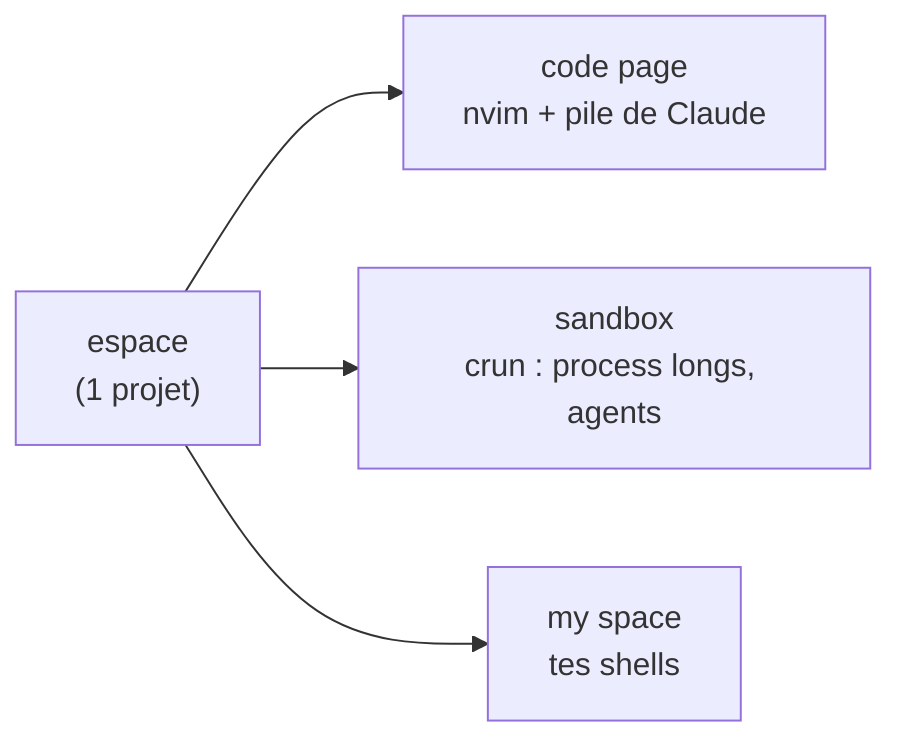
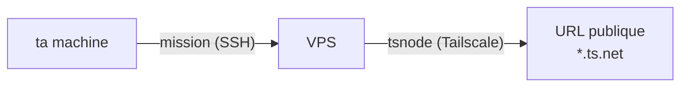

<div align="center">

# thedev

**Tes machines deviennent un seul atelier de dev piloté par l'IA.**
Terminal-natif, multi-machines, sur ton abonnement — **zéro port ouvert, zéro clé API.**


<p>
  
  &nbsp;&nbsp;&nbsp;
  
  &nbsp;&nbsp;&nbsp;
  
  &nbsp;&nbsp;&nbsp;
  
  &nbsp;&nbsp;&nbsp;
  
  &nbsp;&nbsp;&nbsp;
  
</p>

</div>

> **VSCode** édite. **Claude Code** développe à ta place — sur une seule machine. **OpenClaw / Hermes** branchent un assistant dans ta messagerie, contre une clé API et un service exposé sur le net.
>
> **thedev réunit toutes tes machines en un atelier que l'IA pilote depuis le terminal — sans rien exposer, sans API à payer.**

## thedev face au reste

Légende : ✅ dispo · 🔜 sur la roadmap · ⚠️ oui, mais (coût ou risque) · ❌ non

| | **thedev** | VSCode +Copilot | Claude Code | OpenClaw / Hermes |
|---|:--:|:--:|:--:|:--:|
| Terminal-natif, léger | ✅ | ❌ Electron | ✅ | ❌ chat |
| L'IA développe à ta place | ✅ Claude natif | extension | ✅ | ⚠️ via API |
| **Déléguer du travail entre machines** | ✅ missions SSH | ❌ | ❌ 1 machine | ❌ 1 hôte |
| **Process longs isolés** | ✅ `crun` / sandbox | ❌ onglets | ❌ | ❌ |
| **Exposer un service en public** | ✅ 1 commande, 0 port | ❌ | ❌ | ⚠️ gateway exposé |
| Surface d'attaque | ✅ aucun port entrant | — | — | ❌ CVE, 42k exposés |
| Coût | ✅ abonnement seul | ⚠️ abo + API | ✅ abonnement | ❌ 20–500 $/mois d'API |
| Lisible/auditable en une soirée | ✅ bash + fichiers | ❌ | ⚠️ | ❌ gateway Node |
| **🔜 _Autonomie — en construction_** | | | | |
| Déclencheurs programmés (cron) | 🔜 | ❌ | ⚠️ cloud payant | ✅ |
| Notifie quand c'est fini / qqch casse | 🔜 | ❌ | ⚠️ | ✅ |
| Dicter une mission depuis le téléphone | 🔜 | ❌ | ⚠️ pilotage seul | ✅ |
| Mémoire qui apprend entre missions | 🔜 | ❌ | ✅ | ✅ |
| Parallélisme + relecture avant merge | 🔜 worktree | ❌ | ❌ | ❌ |
| Reprise auto après un reboot | 🔜 systemd | — | ❌ | ⚠️ daemon |

> Les 🔜 arrivent **sur l'abonnement et à 0 port** : la puissance d'un OpenClaw, sans sa facture API ni sa surface d'attaque. Pas un nouvel éditeur, pas un nouveau modèle — **la couche qui transforme Claude Code en tissu de dev multi-machines.**

## Anatomie d'un espace



Une **machine** porte des **espaces** (1 projet chacun) ; chaque espace a 3 **pages**, chaque page des **panes**. Un **crun** = un process long lancé dans la sandbox (serveur, watcher, sous-agent). Le vocabulaire complet tient dans [`NAMING.md`](NAMING.md).

## Entre machines

Un espace envoie une **mission** à un espace d'une autre machine (Claude **interactif** via SSH, donc sur l'abonnement — jamais `claude -p`/crédits) ; le résultat revient quand il est prêt, même si tu fermes ton laptop entre-temps. Et un service local devient une **URL HTTPS publique** via un VPS, **sans ouvrir un seul port**.



## Installer

**Avec l'IA** — installe le [CLI Claude](https://docs.claude.com/claude-code), clone le repo, lance `claude` dedans, et donne-lui :

> Installe thedev. Lis `README.md` et `MANIFEST.md`, vérifie les dépendances
> (`./bin/thedev-manifest --check-deps`), installe celles qui manquent, lance
> `./install.sh`, puis dis-moi comment démarrer `dev`.

**À la main :**

```bash
git clone https://github.com/jeanloupdb/thedev.git ~/thedev && cd ~/thedev
./bin/thedev-manifest --check-deps    # ce qui manque
./install.sh                          # puis : source ~/.bashrc && dev
```

Serveur : `./install.sh --vps=<label>`.

## Aller plus loin

- **Toutes les commandes** : [`MANIFEST.md`](MANIFEST.md) (généré) ou `./bin/thedev-manifest`.
- **Dépendances** : zellij, claude, nvim, python3, git, jq, fzf, inotify-tools.
- **À toi** : `thedev-machines` (board cross-machine) — pars de `.example`, le vrai est gitignoré.
