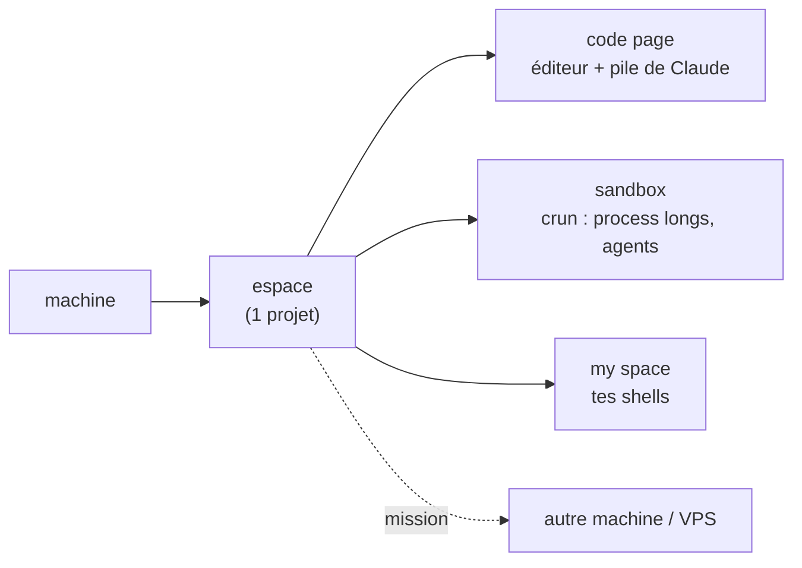

<div align="center">

# thedev

**L'atelier de dev en terminal qui pilote toutes tes machines avec Claude — sur ton abonnement, sans rien exposer.**


<!-- DÉMO : ajoute ici un GIF (vhs / asciinema → agg) du picker + du dashboard.
     C'est l'élément le plus important above the fold — il manque encore. -->

</div>

> [!TIP]
> La puissance d'un agent cloud, **chez toi** : **0 crédit API · 0 port ouvert · 0 clé**. Ton infra, tes machines, tes règles — et c'est lisible/auditable (bash + fichiers).

## ⚡ Installer (avec l'IA, en 1 minute)

Installe le [CLI Claude](https://docs.claude.com/claude-code), clone le repo, lance `claude` dedans, et colle :

> Installe thedev. Lis `README.md` et `MANIFEST.md`, vérifie les dépendances
> (`./bin/thedev-manifest --check-deps`), installe celles qui manquent, lance
> `./install.sh`, puis dis-moi comment démarrer `dev`.

<details>
<summary>… ou à la main</summary>

```bash
git clone https://github.com/jeanloupdb/thedev.git ~/thedev && cd ~/thedev
./bin/thedev-manifest --check-deps    # ce qui manque
./install.sh                          # puis : source ~/.bashrc && dev
```
Serveur : `./install.sh --vps=<label>`. Dépendances : zellij, claude, nvim, python3, git, jq, fzf, inotify-tools.
</details>

## Ce que tu peux faire

**🤖 Travailler avec l'IA**
- **Plusieurs Claude en parallèle** dans un même espace de projet
- Claude en **autonomie** (permissions en bypass) : il agit sans te demander à chaque étape
- Des **panes auto-nommés** par sujet pour t'y retrouver entre 10 Claude
- **Retrouver tes Claude** là où tu les avais laissés après avoir fermé

**🖧 Piloter tes machines**
- **Déléguer une mission** à un autre ordi / un VPS : il bosse pour toi, sur ton abonnement
- **Choisir le modèle** d'une mission (Fable / Opus / Sonnet…)
- **Voir l'état de tout ton parc** d'un coup d'œil (sessions, missions, process) sans ssh
- **Piloter une session VPS depuis l'app Claude** (téléphone / web), automatiquement
- **Pousser un dossier** vers une machine en une commande

**⚙️ Automatiser & exposer**
- Faire **tourner des habitudes** par l'IA sur ton VPS (automatisations programmées, alertes Telegram)
- **Exposer un site/service local en HTTPS public** via ton VPS — sans ouvrir un seul port (Tailscale)
- Lancer et gérer **tout process long** (serveur, build, agent) dans une sandbox

**🎛️ Garder le contrôle**
- Ton **usage Claude** (fenêtre Max 5x) + **RAM** + **CPU** sous les yeux en permanence, discret
- Une page **Infos / dashboard** : version, parc, usage, santé système
- **Tout sur ton abonnement** : pas de crédits, pas de port, pas de clé

## Comment c'est organisé



Une **machine** porte des **espaces** (1 projet chacun), chaque espace a des **pages** et des **panes**. Un **crun** = un process long dans la sandbox. Les espaces s'échangent des **missions**. Vocabulaire complet : [`NAMING.md`](NAMING.md).

## Aller plus loin

- **Toutes les commandes** : [`MANIFEST.md`](MANIFEST.md) (généré) ou `./bin/thedev-manifest`
- **État du parc en direct** : `thedev-status` · **usage Claude** : la barre en bas

---

<div align="center">

Fait pour coder avec Claude sans louer le cloud. ⭐ si ça te parle.

</div>
