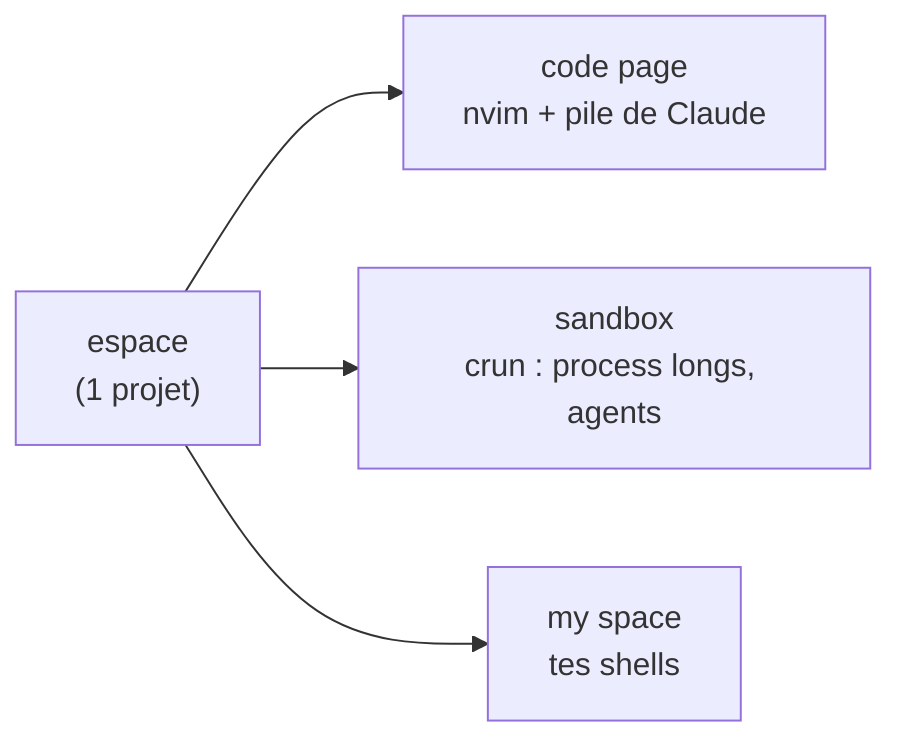
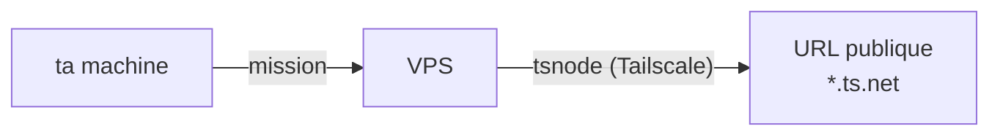

# thedev

Une app de dev en terminal, sur [zellij](https://zellij.dev), faite pour coder avec Claude Code : des espaces de travail structurés, des process longs isolés, et de quoi déléguer du travail entre machines.

## Structure



Une **machine** porte des **espaces** (1 projet chacun), chaque espace a 3 **pages**, chaque page des **panes**. Un **crun** = un process long-running dans la sandbox. Vocabulaire : [`NAMING.md`](NAMING.md).

## Entre machines

Les espaces s'échangent des **missions** (interactif, sur l'abonnement), et un service local peut être exposé en public via un VPS sans ouvrir de port.



## Installer

**Avec l'IA** — installe le [CLI Claude](https://docs.claude.com/claude-code), clone, lance `claude`, et donne-lui :

> Installe thedev. Lis `README.md` et `MANIFEST.md`, vérifie les dépendances
> (`./bin/thedev-manifest --check-deps`), installe celles qui manquent, lance
> `./install.sh`, puis dis-moi comment démarrer `dev`.

**À la main :**

```bash
git clone https://github.com/jeanloupdb/thedev.git ~/thedev && cd ~/thedev
./bin/thedev-manifest --check-deps    # ce qui manque
./install.sh                          # puis : source ~/.bashrc && dev
```

Serveur : `./install.sh --vps=<label>`.

## Le reste

- **Toutes les commandes** : [`MANIFEST.md`](MANIFEST.md) (généré) ou `./bin/thedev-manifest`.
- **Dépendances** : zellij, claude, nvim, python3, git, jq, fzf, inotify-tools.
- **À toi** : `thedev-machines` (board cross-machine) — pars de `.example`, le vrai est gitignoré.
